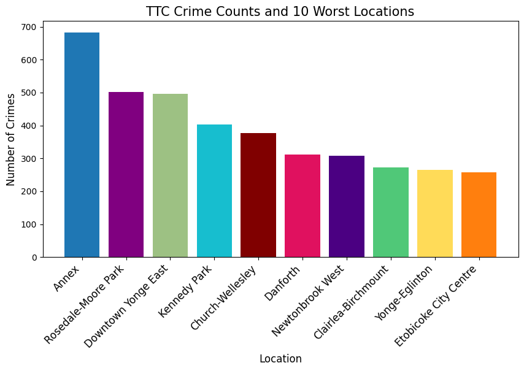

# Crime Prediction for the TTC Using RNN

With the rise in crime on the Toronto Transit Commission (TTC) and limited budgets, there is a need for intelligent and cost-effective public safety planning. This project uses historical crime data from 2014–2023 to train a Recurrent Neural Network (RNN), specifically an LSTM model, to forecast crime trends for the first half of 2024 (January to June) in the 10 most affected Toronto neighbourhoods.

---

## Table of Contents
- [Datasets Used](#datasets-used)
- [Implementation Steps](#implementation-steps)
- [Model Results](#model-results)
- [Key Insights](#key-insights)
- [Limitations](#limitations)
- [Future Work](#future-work)
- [References](#references)
- [Explanation of Files in This Folder](#explanation-of-files-in-this-folder)

---

## Datasets Used

1. <strong>Major Crime Indicators Dataset</strong> ([Toronto Police Service](https://data.torontopolice.on.ca/pages/major-crime-indicators))

- Crimes from Jan 2014 to Dec 2023 (~400,000 records)
- Filtered for crimes related to the TTC
- Focused columns:
  - `OCC_DATE` (occurrence date)
  - `NEIGHBOURHOOD_158` (Toronto neighbourhood)
  - `MCI_CATEGORY` (crime type): Assault, Robbery, Auto Theft, Theft Over, Break and Enter

2. <strong>Neighbourhood Spatial Data</strong> ([City of Toronto](https://open.toronto.ca/dataset/neighbourhoods/))

- Used for heatmap visualization
- Contains Toronto's official neighbourhood boundaries

---

## Implementation Steps

Data Preprocessing

- Filtered to include only TTC-related incidents
- Dropped unnecessary columns
- Aggregated crimes monthly by neighbourhood

Exploratory Analysis

#### Crime Category Trends by Location

- **Crime Types by Neighbourhood:**  
  A multi-line graph visualizing how different types of crime (e.g., Assault, Robbery, etc.) vary over time for the most affected neighbourhoods.  
  

#### Top 10 Locations by Crime Count

- **Top 10 Crime Locations:**  
  A bar chart showing which Toronto neighbourhoods had the highest number of TTC-related crimes.  
  

#### Monthly Crime Count Trends

Each of the top 10 neighbourhoods had its TTC crime data grouped and visualized by month (2014–2023). This helped identify seasonal trends and prepare input for the LSTM model.

- 
- 
- 
- 
- 
- 
- 

Model: LSTM (RNN)

- Grouped monthly counts as time series
- Used `TimeSeriesGenerator` with batch size = 4 (chosen based on testing different values)
- Dataset split:
  - 70% Training (2014–2020)
  - 20% Validation (2021–2022)
  - 10% Test (2023)

Loss Function

- Mean Squared Error (MSE)  
- Chosen for penalizing large errors

---

## Model Results

- The model performs reasonably well for trend prediction, especially in consistent neighbourhoods.
- MSE values vary per neighbourhood.  
  **Example:**
Annex: 10.08
Rosedale-Moore Park: 6.72
Etobicoke City Centre: 2.56

The following heatmap shows predicted crime levels (Jan–June 2024) across Toronto neighbourhoods. Darker regions indicate higher expected crime rates based on the RNN model.  

The final predicted crime trends can be seen over in the following graph.  

---

## Key Insights

- **Annex** and **Rosedale-Moore Park** require the most urgent resource allocation.
- Crimes at the Annex are predicted to rise sharply.
- Most future crimes are expected to be **assaults**.
- Predictions suggest targeted safety investments like more safety officers or emergency buttons, especially in the Annex.

---

## Limitations

- Small dataset (only ~120 monthly records per location)
- COVID-19 likely skewed 2020–2022 trends. This is also a problem because 2020-2022 years are used for data validation as well. 
- No data scaling or transformer models due to resource constraints

---

## Future Work

- Integrate input scaling
- Explore ARIMA models for comparison
- Expand predictions to all 158 neighbourhoods
- Compare predicted vs. actual results after June 2024

---

## 📚 References

1. [Toronto Transit Commission - City of Toronto](https://www.toronto.ca/city-government/accountability-operations-customer-service/city-administration/city-managers-office/agencies-corporations/agencies/toronto-transit-commission/)
2. [Toronto Star Article on TTC Crime](https://www.thestar.com/news/gta/major-crime-on-toronto-public-transit-up-by-double-digit-figures-since-start-of-year/article_62dc9639-2043-5d82-9eaa-efa541434820.html)
3. [The Globe and Mail: TTC Funding](https://www.theglobeandmail.com/canada/article-ttc-costs-subsidies-ridership/)
4. [Toronto Neighbourhood Open Data](https://open.toronto.ca/dataset/neighbourhoods/)
5. [Neighbourhood Crime Rates - TPS](https://data.torontopolice.on.ca/datasets/TorontoPS::neighbourhood-crime-rates-open-data/explore)
6. [Major Crime Indicators - TPS](https://data.torontopolice.on.ca/pages/major-crime-indicators)

---

## Explanation of Files in This Folder

Click to expand

- **Major_Crime_Indicators_Open_Data.csv**:  
Original dataset by the Toronto Police Service which contains information on reported crimes. Please note the dataset is updated periodically; however, for this project, the dataset used is up to the end of December 2023.

- **Data Preprocessing.ipynb**:  
Takes the original dataset and creates a new CSV keeping only the rows related to crime incidents that happened on the TTC. Produces `Processed_crime_dataset.csv`.

- **Processed_crime_dataset.csv**:  
Resulting dataset after initial processing, which involves removing all rows that aren’t related to TTC. This dataset, containing ~11,000 records, is used for data analysis and modeling.

- **TTC Crime Model Implementation.ipynb**:  
Contains all code for the initial analysis of data (including identifying the top 10 most problematic neighbourhoods), graphing trends, training the RNN model, and visualizing crime on a map.

- **Neighbourhoods.geojson**:  
Original dataset by the City of Toronto Open Data with information on all of Toronto’s neighbourhoods. Used by GeoPandas for mapping neighbourhoods in the visualizations.

